**Team Members:**
- Elise Wirthlin
- Josh Breiter

---

## 1. Self Attack

### Peer 1: Elise Wirthlin

#### Attack 1.1
| Item           | Result                                                                         |
| -------------- | ------------------------------------------------------------------------------ |
| Date           | June 13, 2026                                                                  |
| Target         | pizza.elisew.click/register                                                       |
| Classification | Broken Access Control                                                                      |
| Severity       | 2                                                                             |
| Description    | Attempted to re-register an existing user account to overwrite credentials/privileges                 |
| Images         | 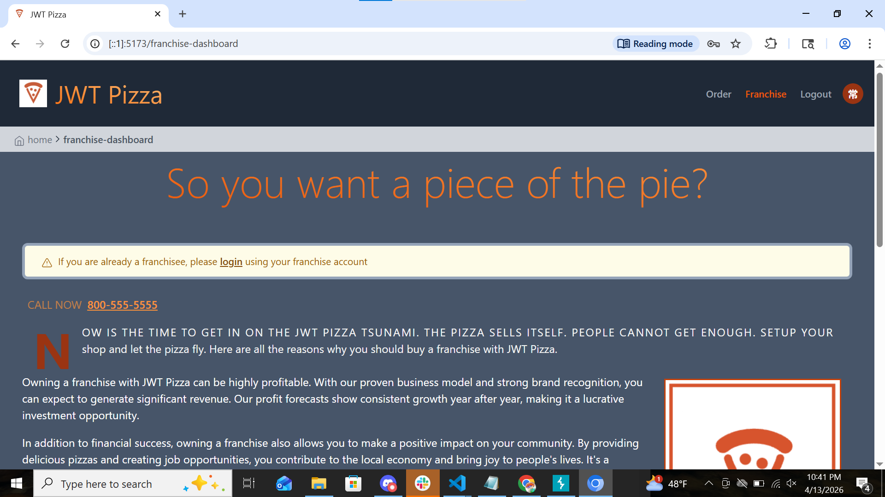   can still log into past user, but admin priveleges may have been removed. |
| Corrections    | Check if user already exists before registering.                                                          |
#### Attack 1.2
| Item           | Result                                                                         |
| -------------- | ------------------------------------------------------------------------------ |
| Date           | June 13, 2026                                                                  |
| Target         | pizza.elisew.click/api/order   POST                                                       |
| Classification | Broken Access Control                                                                     |
| Severity       | 0                                                                              |
| Description    | Order with previously logged out user. User unauthorized |
| Images         | 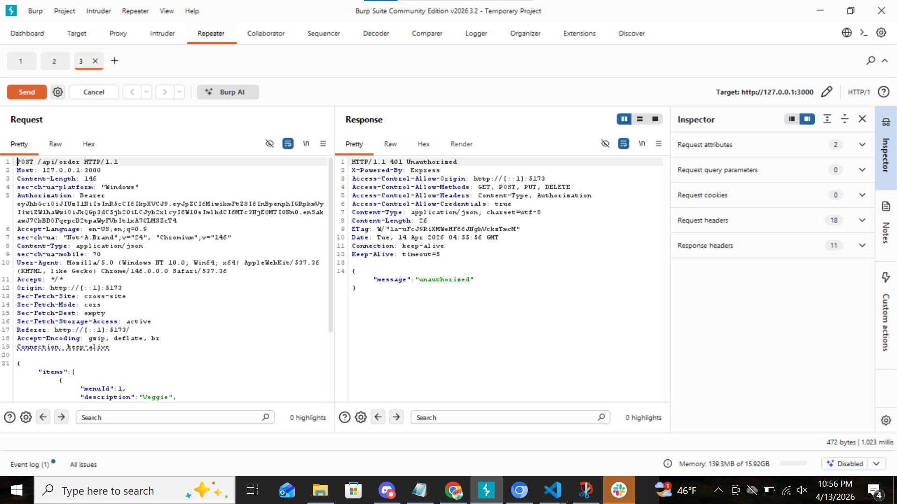  . autentication missing.|
| Corrections    | None. Code works properly        |
#### Attack 1.3
| Item           | Result                                                                         |
| -------------- | ------------------------------------------------------------------------------ |
| Date           | June 13, 2026                                                                  |
| Target         | pizza.elisew.click/api/order   POST                                                       |
| Classification | Broken Access Control                                                                      |
| Severity       | 2                                                                            |
| Description    | Altering the price of the order to $0, -$1000000000, $-1, and $100000000. Could order for 0 and -1, but the larger values were out of range.              |
| Images         |   .   .
 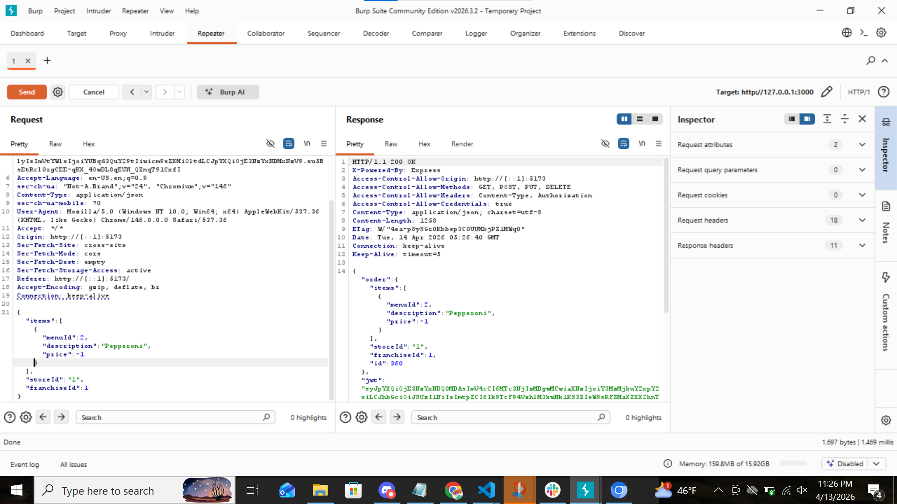  . 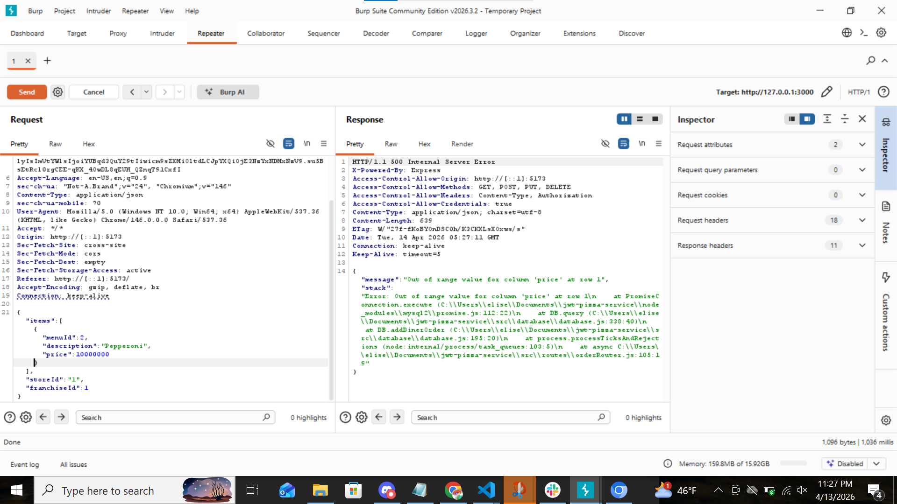  . could order for 0 and negative 1, but the larger values were out of range. |
| Corrections    | double check that price matches database item order price. Don't allow negative numbers or 0.      |
#### Attack 1.4
| Item           | Result                                                                         |
| -------------- | ------------------------------------------------------------------------------ |
| Date           | June 13, 2026                                                                  |
| Target         | pizza.elisew.click/api/order   POST                                                       |
| Classification | Broken Access Control                                                                      |
| Severity       | 2                                                                           |
| Description    | change order to non-existent store. was able to order with a non-existing store. order successfully placed                |
| Images         | 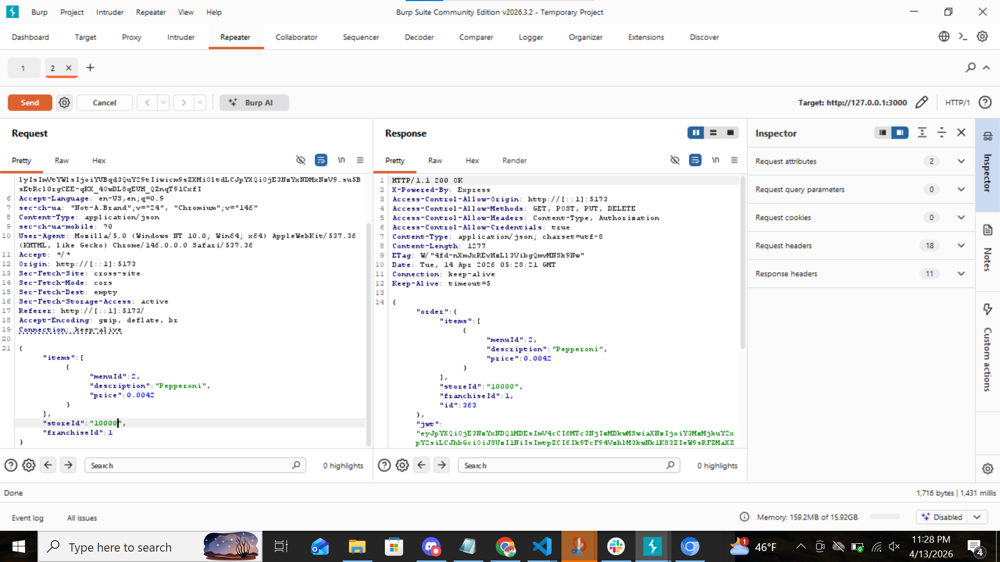  . placed an order with non-existing store|
| Corrections    | check that store exists before ordering   |

#### Attack 1.5
| Item           | Result                                                                         |
| -------------- | ------------------------------------------------------------------------------ |
| Date           | June 13, 2026                                                                  |
| Target         | pizza.elisew.click/api/order   POST                                                       |
| Classification | Broken Access Control                                                                     |
| Severity       | 2                                                                            |
| Description    | change order to non-existent franchise. order successfully placed               |
| Images         |   .  placed an order with non-existing franchise |
| Corrections    | check that franchise exists before ordering   |

#### Attack 1.6
| Item           | Result                                                                         |
| -------------- | ------------------------------------------------------------------------------ |
| Date           | June 13, 2026                                                                  |
| Target         | pizza.elisew.click/api/auth PUT       |
| Classification | injection                                                                    |
| Severity       | 0                                                                            |
| Description    | SQL injection through user login to try to delete database users. SQL injection failed. User's were protected |
| Images         | 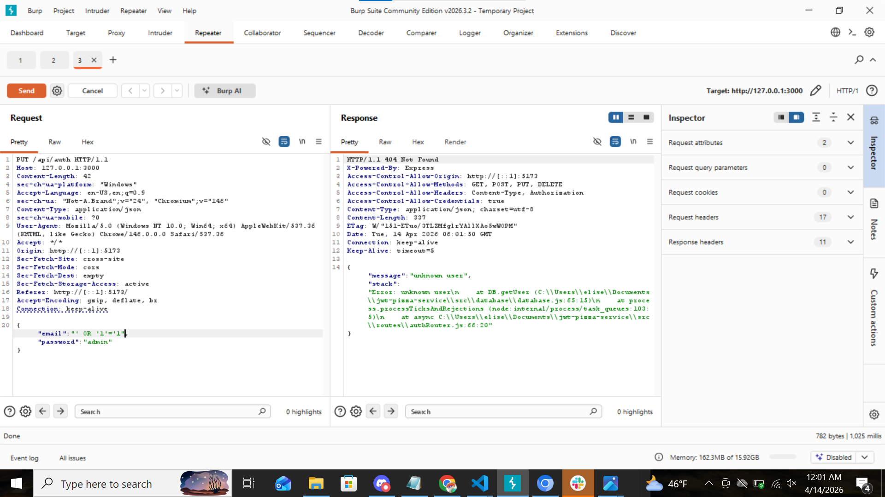  .    . = 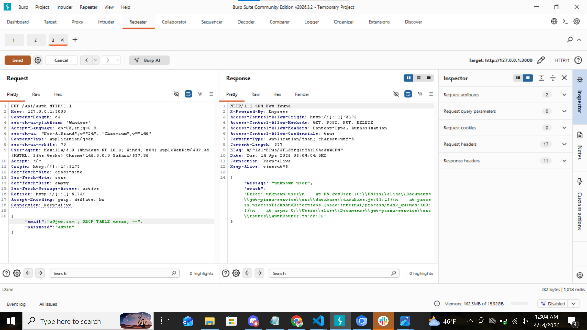  . User delete attempts.  .    . User delete attempts did not work. Can still log in previous user.|
| Corrections    | None. code is properly protecting against SQL injections   |

---

### Peer 2: Josh Breiter

#### Attack 2.1
| Item           | Result |
| -------------- | ------ |
| Date           | 4/13/2026|
| Target         | https://pizzz.jbreiter.click |
| Classification | Authentication failure |
| Severity       | 3 |
| Description    |Discovered that the administrative account used a default or easily guessable password (e.g. "admin") and there is no rate limiting on the login attempts. This allowed full access to the admin dashboard through a brute force attack.|
| Images         | 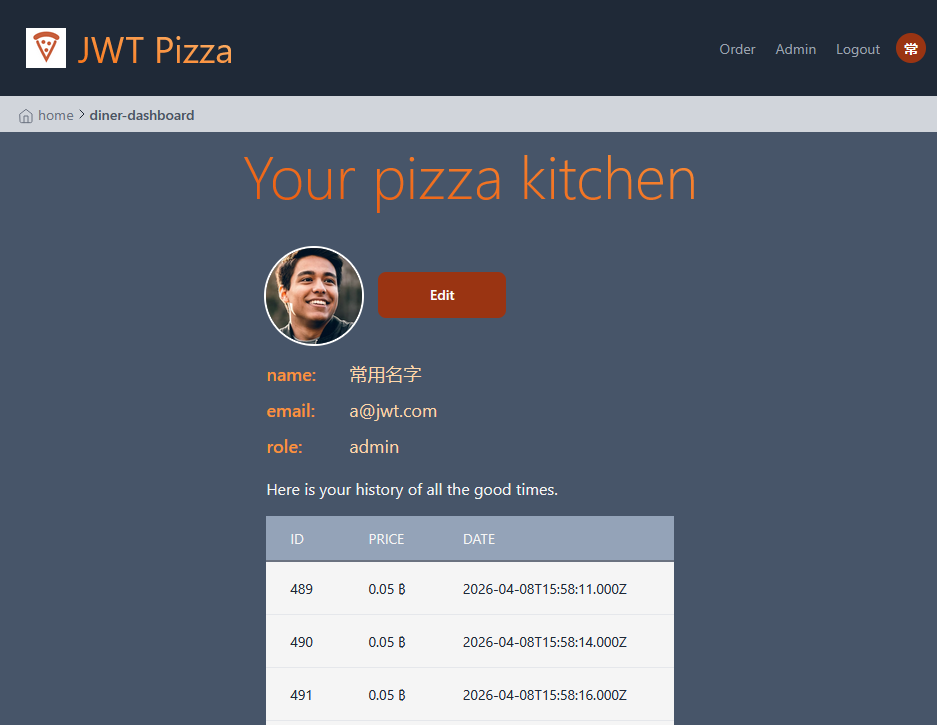|
| Corrections    | Change the admin password to be something more secure, implement minimum password complexity requirements. Add rate limiting to prevent brute force attacks. |

#### Attack 2.2
| Item           | Result |
| -------------- | ------ |
| Date           | 4/14/26 |
| Target         | https://pizza.jbreiter.click/api/order |
| Classification | Broken access control / insecure design |
| Severity       | 3 |
| Description    | The frontend calculates the cart total and passes the order object directly to pizzaService.order(order). If the backend trusts the item prices sent from the frontend without cross-referencing a trusted server-side database, an attacker can manipulate the price of a pizza to 0 ₿ or even a negative amount. |
| Images         | 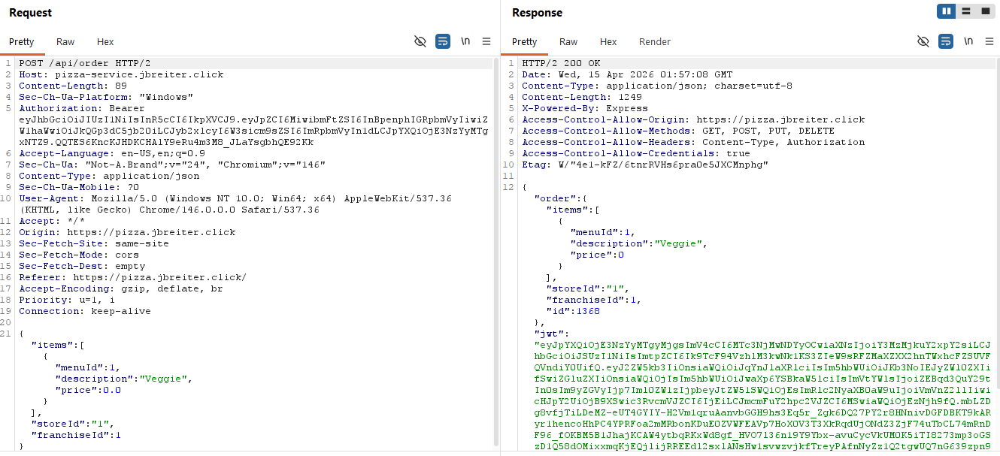 |
| Corrections    | Do not trust client-supplied pricing. The backend must recalculate the total based on the item IDs using a trusted server-side menu database. |

#### Attack 2.3
| Item           | Result |
| -------------- | ------ |
| Date           | 4/14/26 |
| Target         |https://pizza.jbreiter.click/|
| Classification |Insecure design|
| Severity       |2|
| Description    |The user profile page shows the id number of any franchise they are a franchise owner for, which leaks internal application state information up to the user. This could then be chained to impact other parts of the system that use id numbers. |
| Images         | 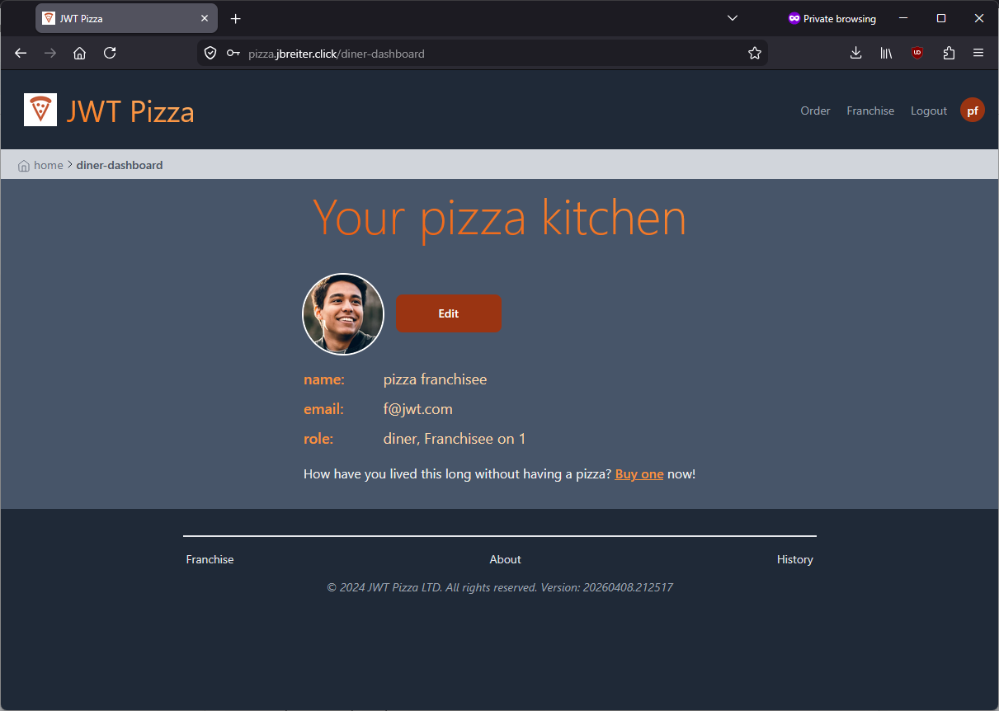|
| Corrections    | Update the role list to display the name of the franchise instead of the id number to avoid leaking application state. |

#### Attack 2.4
| Item           | Result |
| -------------- | ------ |
| Date           |4/14/26 |
| Target         |https://pizza.jbreiter.click/api/order|
| Classification |Injection, insecure design|
| Severity       |4|
| Description    |User is able to replay payloads after editing them when purchasing pizzas. This in turn could be used to falsify transactions or defraud the pizza factory by paying out for things which were never spent. |
| Images         |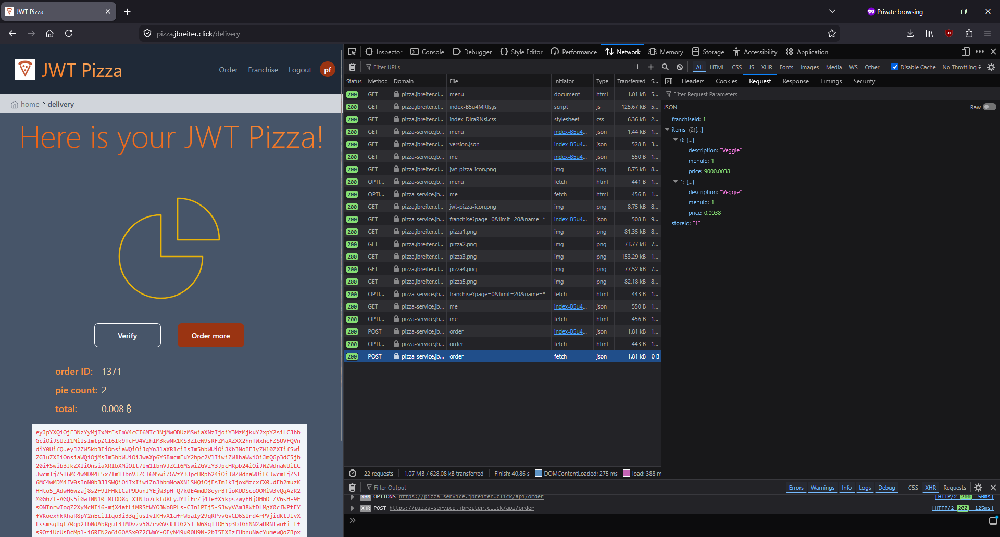|
| Corrections    |Update payment endpoint to prevent request editing by adding a single-use token. |

#### Attack 2.5
| Item           | Result |
| -------------- | ------ |
| Date           |4/14/26 |
| Target         |https://pizzz.jbreiter.click/diner-dashboard & https://pizza.jbreiter.click/api/user/|
| Classification |Security misconfiguration, vulnerable components, cryptographic failures|
| Severity       |3|
| Description    |When updating the user's password on the `diner-dashboard` page, the password is shown in plain text and sent in the JSON as plain text. If the user is a victim to a Man-in-the-Middle attack with certificate pinning (which allows for decryption of TLS/HTTPS), the password is exposed. This also makes the password visible to shoulder surfers who are watching nearby. |
| Images         | 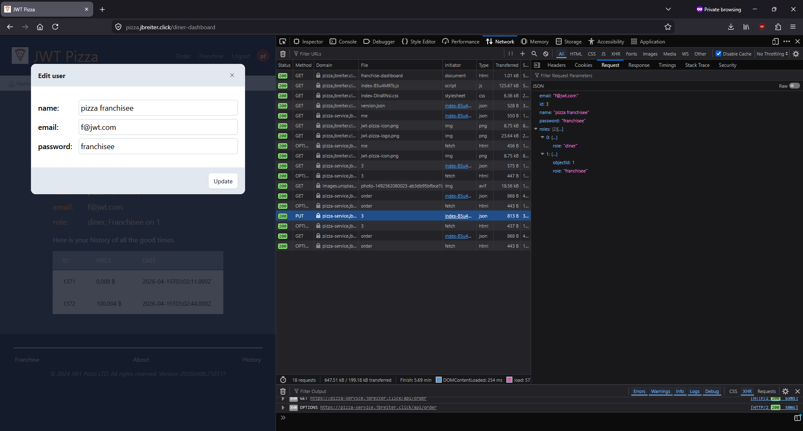|
| Corrections    |Update the field to use "password" instead of "text", verify the user's current password and then hash + salt the new password before sending it to the backend and storing it there.  |

---

## 2. Peer Attack

### Peer 1 (Elise Wirthlin) Attack on Peer 2 (Josh Breiter)

#### Attack P1.1
| Item           | Result                                                                         |
| -------------- | ------------------------------------------------------------------------------ |
| Date           | June 14, 2026                                                                  |
| Target         | https://pizza.jbreiter.click/register                                                       |
| Classification | Broken Access Control                                                                      |
| Severity       | 2                                                                             |
| Description    | Attempted to re-register an existing user account to overwrite credentials/privileges.  can register for user with the same name, but when you go to login with that new user, it won't let you. did not affect admin controls            |
| Images         |   successful register for new user.   unsuccessful login for newly registered user. |
| Corrections    | Check if user already exists before registering.                                                          |
#### Attack P2.2
| Item           | Result                                                                         |
| -------------- | ------------------------------------------------------------------------------ |
| Date           | June 14, 2026                                                                  |
| Target         |https://pizza.jbreiter.click/api/order   POST                                                     |
| Classification | Broken Access Control                                                                     |
| Severity       | 0                                                                              |
| Description    | Order with previously logged out user. User unauthorized |
| Images         |   . autentication missing.|
| Corrections    | None. Code works properly        |
#### Attack P2.3
| Item           | Result                                                                         |
| -------------- | ------------------------------------------------------------------------------ |
| Date           | June 14, 2026                                                                  |
| Target         | https://pizza.jbreiter.click/api/order   POST           |
| Classification | Broken Access Control                                                                      |
| Severity       | 2                                                                            |
| Description    | Altering the price of the order to $0, -$1000000000, $-1, and $100000000. Could order for all values 0 and -1, but the larger values were truncated to 99.999 or -99.999.              |
| Images         | |
| Corrections    | double check that price matches database item order price. Don't allow negative numbers, 0, or exceptionally large numbers.      |
#### Attack P2.4
| Item           | Result                                                                         |
| -------------- | ------------------------------------------------------------------------------ |
| Date           | June 14, 2026                                                                  |
| Target         | https://pizza.jbreiter.click/api/order   POST     |
| Classification | Broken Access Control                                                                      |
| Severity       | 2                                                                           |
| Description    | change order to non-existent store. order successfully placed                |
| Images         |   . placed an order with non-existing store|
| Corrections    | check that store exists before ordering   |

#### Attack P2.5
| Item           | Result                                                                         |
| -------------- | ------------------------------------------------------------------------------ |
| Date           | June 14, 2026                                                                  |
| Target         |https://pizza.jbreiter.click/api/order   POST   |
| Classification | Broken Access Control                                                                     |
| Severity       | 2                                                                            |
| Description    | change order to non-existent franchise. order successfully placed               |
| Images         |   .  placed an order with non-existing franchise |
| Corrections    | check that franchise exists before ordering   |

---

### Peer 2 (Josh Breiter) Attack on Peer 1 (Elise Wirthlin)

#### Attack P2.1
| Item           | Result |
| -------------- | ------ |
| Date           |4/14/26 |
| Target         | https://pizza.elisew.click/api/franchise |
| Classification | Auth failure, insecure design |
| Severity       | 4 |
| Description    |User was able to delete franchise which belonged to another user by guessing the id number of the franchise. Since the id's are sequentially assigned, this is trivial to do when watching the network requests in the developer tools. |
| Images         | Before: 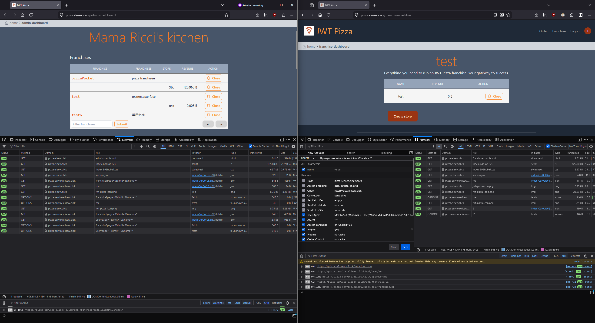 After: 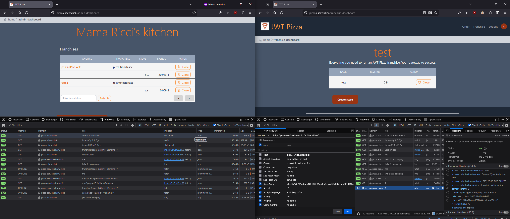|
| Corrections    | Update franchise deletion to check if the person deleting is a franchise owner. |

#### Attack P2.2
| Item           | Result |
| -------------- | ------ |
| Date           |4/13/26 |
| Target         |https://pizza.elisew.click/diner-dashboard|
| Classification |Insecure design|
| Severity       |2|
| Description    |The user profile page shows the id number of any franchise they are a franchise owner for, which leaks internal application state information up to the user. This could then be used to pivot to other parts of the system. |
| Images         |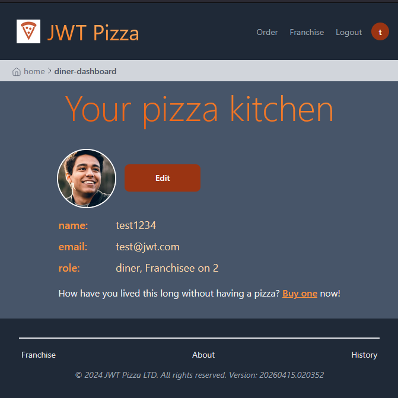|
| Corrections    | Update to use the name of the franchise instead of the internal id number. |

#### Attack P2.3
| Item           | Result |
| -------------- | ------ |
| Date           |4/14/26|
| Target         |https://pizza.elise.w.click/register|
| Classification |Insecure design|
| Severity       | 2 |
| Description    |The system leaks stack traces into the browser console when a user attempts to register as an existing user. This in turn gives the attacker information about the directory structure of the application.|
| Images         |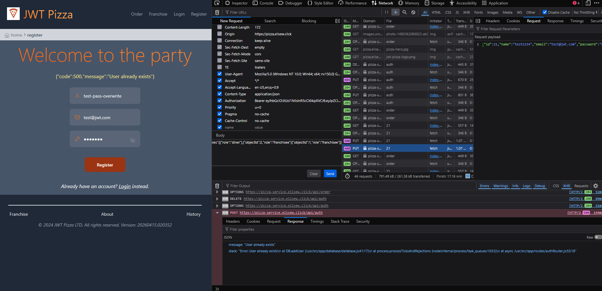|
| Corrections    |Change the error generation to not leak the stack trace to the browser console and log full details to the server log.|

#### Attack P2.4
| Item           | Result |
| -------------- | ------ |
| Date           |4/14/26|
| Target         |https://pizza.elisew.click/admin-dashboard/close-franchise|
| Classification |Insecure design|
| Severity       |2|
| Description    |Navigating to the URL crashes the application and renders it unusable, regardless of permissions assigned. |
| Images         |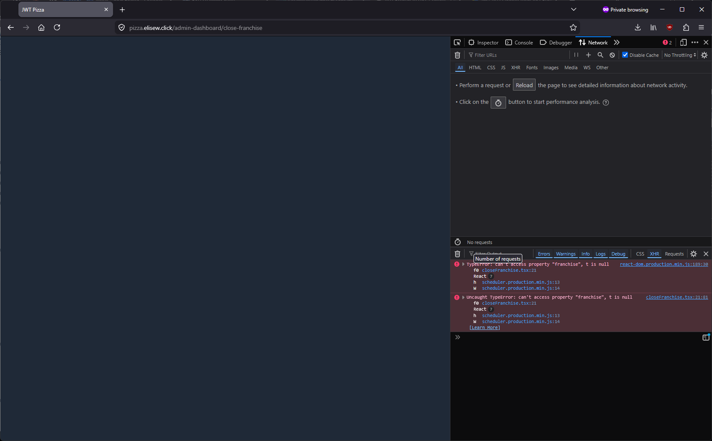|
| Corrections    |Check authentication before navigating to the URL and redirect if not an admin.|

#### Attack P2.5
| Item           | Result |
| -------------- | ------ |
| Date           |4/14/26|
| Target         |https://pizza.elisew.click/admin-dashboard|
| Classification |Injection|
| Severity       |0|
| Description    |Attempting to forge a JWT token and give the user an admin role fails to grant access to the admin dashboard.|
| Images         |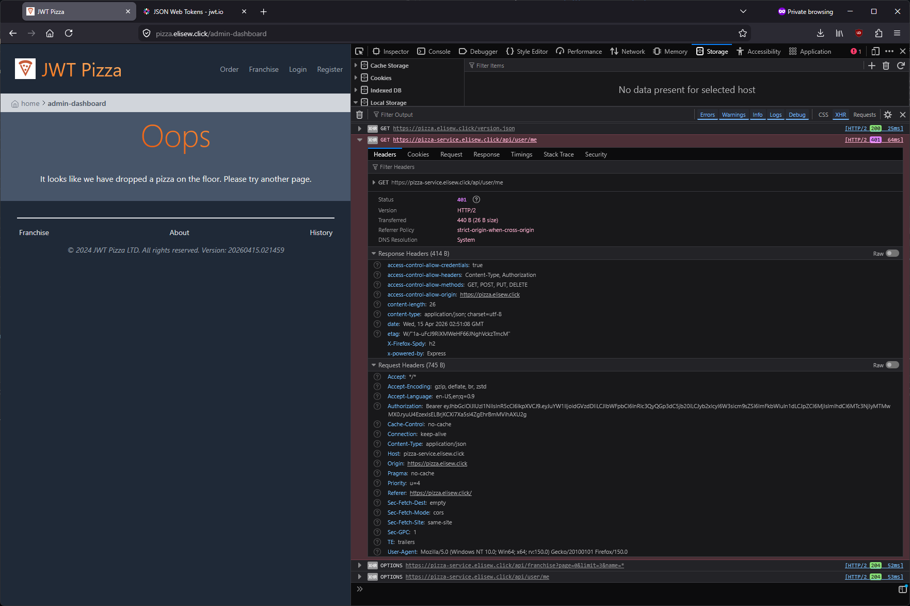|
| Corrections    |No correction needed. |

---

## 3. Combined Summary of Learnings

A lot of security issues are caused simply because you don’t sanitize the user input. Even if there’s no way to enter weird input from the website, there might still be workarounds for malicious users to enter weird input (like editing the input through Burp), so it’s best to always err on the side of being over-cautious. When updating user information, it is better to only send the parts which need to be modified instead of the whole object. By sending the entire user object from the client to the server, it allows an attacker to modify the database contents without needing access to the database. In terms of security posture, it is best to treat anything client side as untrusted and then to sanitize and validate it before using it. 

Related to treating client side inputs as untrusted, anything involving pricing and purchasing should be handled server side to prevent tampering and replay attacks. Failure to do so allows anyone to modify their order and falsify the actual amount spent. Using one-time tokens and hashing is a good way to prevent replay attacks, as it ensures the integrity of the message and shows that it hasn’t been modified from the source. 

In terms of information availability, for fields which handle sensitive information, the correct field-type should be used to avoid leaking information. When doing anything related to passwords, hashing and salting should be used to protect the user’s credentials, both in-transit and at rest. In an ideal world, the best password is one that you don’t store, yet validates that they are who they claim to be.

With regards to the internal workings of the application, exposing stack traces and raw errors to the front end should be avoided. Care should be taken to not pass error messages to the browser and instead logged internally. As a result, it increases the amount of effort the attacker has to spend on determining how your application works. 

Through this penetration testing assignment, we identified several key security issues to be aware of in our jwt-pizza websites and to look out for in any future web applications we create. These issues are: sanitizing and validating user inputs, handling purchasing server side, using hashing and tokens to protect sensitive information, and not leaking internal application structure and state.